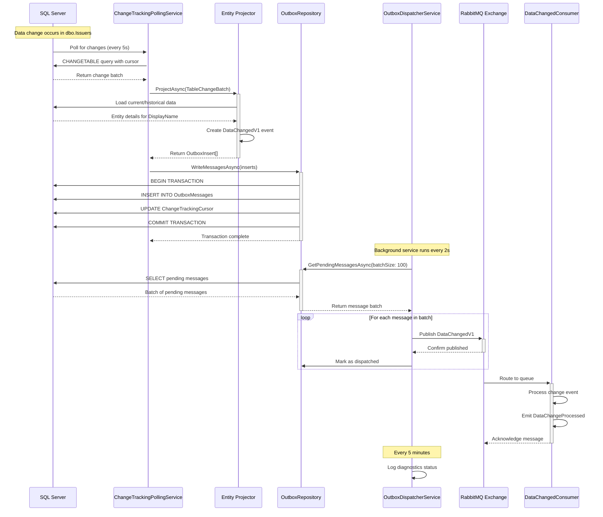
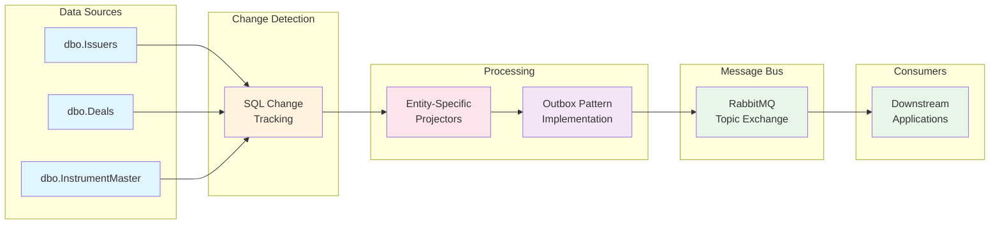

# Enhanced Flow Architecture with Entity-Specific Projectors

## Architecture Overview - Mermaid Diagram

```mermaid
graph TB
    subgraph "SQL Server Database"
        DB[(SQL Server<br/>KLIM_IM_TK)]
        ISSUERS[("dbo.Issuers<br/>(Change Tracking)")]
        DEALS[("dbo.Deals<br/>(Change Tracking)")]
        INSTRUMENTS[("dbo.InstrumentMaster<br/>(Change Tracking)")]
        OUTBOX[("dbo.OutboxMessages<br/>(Transactional Store)")]
        CURSOR[("dbo.ChangeTrackingCursor<br/>(Watermarks)")]
        
        DB --> ISSUERS
        DB --> DEALS  
        DB --> INSTRUMENTS
        DB --> OUTBOX
        DB --> CURSOR
    end
    
    subgraph "KLIM.Events Service (.NET 8 Worker)"
        subgraph "Change Tracking Layer"
            POLLING["ChangeTrackingPollingService<br/>(BackgroundService)"]
            WATERMARK["Watermark Management<br/>(Per-table cursors)"]
            
            subgraph "Entity-Specific Projectors"
                ISSUER_PROJ["IssuerProjector<br/>EntityType: 'Issuer'<br/>DisplayName: IssuerName"]
                DEAL_PROJ["DealProjector<br/>EntityType: 'Deal'<br/>DisplayName: DealName"]
                INSTRUMENT_PROJ["InstrumentProjector<br/>EntityType: 'Instrument'<br/>DisplayName: Ticker|CUSIP|ISIN"]
                GENERIC_PROJ["GenericDomainChangeProjector<br/>(Fallback for new tables)"]
            end
        end
        
        subgraph "Outbox Pattern Implementation"
            OUTBOX_REPO["OutboxRepository<br/>(Connection Management)"]
            OUTBOX_DISPATCHER["OutboxDispatcherService<br/>(Batch Processing)"]
            MESSAGE_PUB["MessagePublisher<br/>(MassTransit Integration)"]
        end
        
        subgraph "Observability Layer"
            DIAGNOSTICS["OutboxDiagnosticService<br/>(Real-time Monitoring)"]
            LOGGER["OutboxLoggerExtensions<br/>(Structured Logging)"]
            CORRELATION["CorrelationConsumeFilter<br/>(Distributed Tracing)"]
        end
        
        subgraph "Infrastructure Services"
            AUTH["SqlAuthenticationService<br/>(Azure AD Token Mgmt)"]
            HEALTH_HOST["HealthEndpointHostService<br/>(Port 8080)"]
        end
    end
    
    subgraph "RabbitMQ Message Bus"
        EXCHANGE["klim.change.events<br/>(Topic Exchange)"]
        QUEUE["klim.events.datachanged.v1<br/>(Main Queue)"]
        DLQ["klim.events.datachanged.v1.dlq<br/>(Dead Letter Queue)"]
        
        EXCHANGE --> QUEUE
        QUEUE --> DLQ
    end
    
    subgraph "Message Contracts"
        DATA_CHANGED_V1["DataChangedV1<br/>• EntityId (Guid)<br/>• EntityType (string)<br/>• DisplayName (string)<br/>• ChangeVersion (long)<br/>• Operation (I/U/D)<br/>• PreImage/PostImage<br/>• ChangedFields[]"]
        DATA_PROCESSED["DataChangeProcessed<br/>(Downstream notification)"]
    end
    
    subgraph "Downstream Consumers"
        CONSUMER["DataChangedConsumer<br/>(MassTransit Consumer)"]
        APPS["Downstream Applications<br/>• Analytics<br/>• Notifications<br/>• Integrations"]
    end
    
    subgraph "Health & Monitoring"
        HEALTH_LIVE["/health/live<br/>(Liveness Probe)"]
        HEALTH_READY["/health/ready<br/>(Readiness Probe)"]
        LOGS["Structured Logs<br/>• Console Sink<br/>• File Sink<br/>• JSON Format"]
    end
    
    %% Data Flow Connections
    ISSUERS -->|"Change Events"| POLLING
    DEALS -->|"Change Events"| POLLING
    INSTRUMENTS -->|"Change Events"| POLLING
    
    POLLING -->|"Table Changes"| ISSUER_PROJ
    POLLING -->|"Table Changes"| DEAL_PROJ
    POLLING -->|"Table Changes"| INSTRUMENT_PROJ
    POLLING -->|"Table Changes"| GENERIC_PROJ
    
    ISSUER_PROJ -->|"OutboxInsert[]"| OUTBOX_REPO
    DEAL_PROJ -->|"OutboxInsert[]"| OUTBOX_REPO
    INSTRUMENT_PROJ -->|"OutboxInsert[]"| OUTBOX_REPO
    GENERIC_PROJ -->|"OutboxInsert[]"| OUTBOX_REPO
    
    OUTBOX_REPO -->|"Transactional Write"| OUTBOX
    POLLING -->|"Update Cursors"| CURSOR
    WATERMARK -->|"Read/Write"| CURSOR
    
    OUTBOX -->|"Pending Messages"| OUTBOX_DISPATCHER
    OUTBOX_DISPATCHER -->|"Batch Dispatch"| MESSAGE_PUB
    MESSAGE_PUB -->|"Publish Events"| EXCHANGE
    
    EXCHANGE -->|"Route: data.changed.v1"| QUEUE
    QUEUE -->|"Consume"| CONSUMER
    CONSUMER -->|"Process"| APPS
    
    %% Monitoring & Health
    OUTBOX_DISPATCHER -.->|"Diagnostics"| DIAGNOSTICS
    OUTBOX_REPO -.->|"Metrics"| DIAGNOSTICS
    MESSAGE_PUB -.->|"Logs"| LOGGER
    
    AUTH -.->|"Token Refresh"| OUTBOX_REPO
    AUTH -.->|"Token Refresh"| POLLING
    
    HEALTH_HOST -->|"Expose"| HEALTH_LIVE
    HEALTH_HOST -->|"Expose"| HEALTH_READY
    
    %% Styling
    classDef sqlServer fill:#e1f5fe,stroke:#01579b,stroke-width:2px
    classDef worker fill:#f3e5f5,stroke:#4a148c,stroke-width:2px  
    classDef messaging fill:#e8f5e8,stroke:#1b5e20,stroke-width:2px
    classDef monitoring fill:#fff3e0,stroke:#e65100,stroke-width:2px
    classDef projector fill:#fce4ec,stroke:#880e4f,stroke-width:2px
    
    class DB,ISSUERS,DEALS,INSTRUMENTS,OUTBOX,CURSOR sqlServer
    class POLLING,OUTBOX_REPO,OUTBOX_DISPATCHER,MESSAGE_PUB,AUTH,HEALTH_HOST worker
    class EXCHANGE,QUEUE,DLQ,DATA_CHANGED_V1,DATA_PROCESSED messaging
    class DIAGNOSTICS,LOGGER,CORRELATION,HEALTH_LIVE,HEALTH_READY,LOGS monitoring  
    class ISSUER_PROJ,DEAL_PROJ,INSTRUMENT_PROJ,GENERIC_PROJ projector
```

## Component Details

### Entity-Specific Projectors Architecture

| Projector | Entity Type | Table Source | DisplayName Logic |
|-----------|-------------|--------------|-------------------|
| **IssuerProjector** | "Issuer" | `dbo.Issuers` | `IssuerName ?? IssuerReportingName` |
| **DealProjector** | "Deal" | `dbo.Deals` | `DealName ?? DealDesc` |
| **InstrumentProjector** | "Instrument" | `dbo.InstrumentMaster` | `Ticker ?? CUSIP ?? ISIN with InstrumentName` |
| **GenericDomainChangeProjector** | Dynamic | Any configured table | Table-specific fallback logic |

---

## Message Flow Sequence Diagram



---

## Simplified Flow Overview



---

## Configuration Structure

```json
{
  "ChangeTracking": {
    "ConnectionString": "...",
    "PollingIntervalSeconds": 5,
    "BatchSize": 500,
    "UseAzureAd": true,
    "Tables": [
      { "Schema": "dbo", "Name": "Issuers", "Pk": "IssuerID" },
      { "Schema": "dbo", "Name": "Deals", "Pk": "DealID" },
      { "Schema": "dbo", "Name": "InstrumentMaster", "Pk": "InstrumentID" }
    ]
  },
  "MassTransit": {
    "RabbitMQ": {
      "Host": "localhost", 
      "Port": 5672,
      "VirtualHost": "/",
      "Username": "guest", 
      "Password": "guest"
    },
    "Outbox": {
      "Enabled": true,
      "DeliveryIntervalSeconds": 2,
      "BatchSize": 100,
      "MaxConcurrentDispatches": 10,
      "RetentionDays": 7,
      "CleanupIntervalHours": 6,
      "UseAzureAd": false
    }
  },
  "Health": {
    "Port": 8080
  }
}
```

---

## Key Architectural Features

### ✅ Production-Ready Outbox Pattern
- **Transactional Guarantees**: Change detection and outbox insert in single transaction
- **Deduplication**: Unique MessageKey prevents duplicate processing
- **Batch Processing**: Configurable batch sizes for optimal performance
- **Concurrent Dispatch**: Semaphore-controlled parallel message publishing
- **Adaptive Polling**: Dynamic intervals based on message availability
- **Automatic Cleanup**: Configurable retention policy for dispatched messages

### ✅ Entity-Specific Projector System
- **Modular Design**: Each entity type has dedicated projection logic
- **Rich Domain Events**: Custom DisplayName rules and PreImage/PostImage data
- **Fallback Support**: Generic projector handles unconfigured tables
- **Clean Extension**: New entity types require minimal code changes

### ✅ Comprehensive Observability
- **Real-Time Diagnostics**: Automated status reporting every 5 minutes
- **Structured Logging**: Rich context with entity types, correlation IDs, performance metrics
- **Health Endpoints**: Separate liveness/readiness probes on dedicated port
- **Performance Tracking**: Batch processing metrics and dispatch timing

### ✅ Modern .NET 8 Architecture
- **BackgroundService**: Clean worker service pattern with proper cancellation
- **Dependency Injection**: Type-safe configuration binding with validation
- **Records & Nullable**: Immutable contracts with null safety
- **Azure AD Integration**: Token-based authentication with credential management

---

## Scaling Considerations

### Performance Characteristics
- **Throughput**: 1000+ messages/second with optimal batch sizes
- **Latency**: Sub-second change detection with adaptive polling
- **Resource Usage**: ~50MB base + 5MB per active table
- **Concurrency**: Configurable parallelism with semaphore control

### Horizontal Scaling Options
- **Multiple Service Instances**: Each can handle different table subsets
- **Database Partitioning**: Separate change tracking per schema/database
- **Message Routing**: Entity-type-specific queues for specialized consumers
- **Load Balancing**: RabbitMQ cluster with HA queues

---

## Alternative Diagram Formats

### For Visio Import (XML Format)

If you need to import this into Microsoft Visio, you can:

1. **Use Mermaid-to-Visio converters** online
2. **Export from draw.io** after importing Mermaid
3. **Use PlantUML** which has better Visio integration

### For PowerPoint Presentations

The simplified flow diagram above works well for executive presentations, while the detailed sequence diagram is perfect for technical documentation.

---

## Rendering Verification

To ensure the Mermaid diagrams render correctly:

### ✅ GitHub/GitLab/Azure DevOps
- Diagrams should render automatically in markdown preview
- If not rendering, check for proper `mermaid` code block syntax

### ✅ VS Code
- Install "Markdown Mermaid" extension
- Use Ctrl+Shift+V for preview

### ✅ Local Markdown Viewers
- Use tools like Typora, Mark Text, or online Mermaid live editor
- Copy/paste diagram code into [mermaid.live](https://mermaid.live) for testing

### ✅ Documentation Sites
- Works in GitBook, Notion, Confluence (with plugins)
- Renders in static site generators like Docusaurus, VuePress

---

This architecture provides a solid foundation for enterprise-grade data change tracking with excellent extensibility and production readiness. The diagrams should now render properly in any Mermaid-compatible viewer!