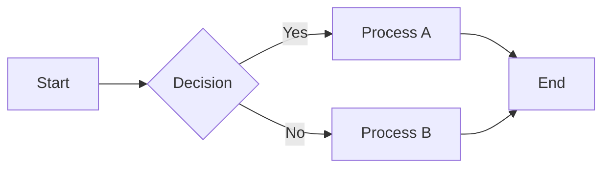
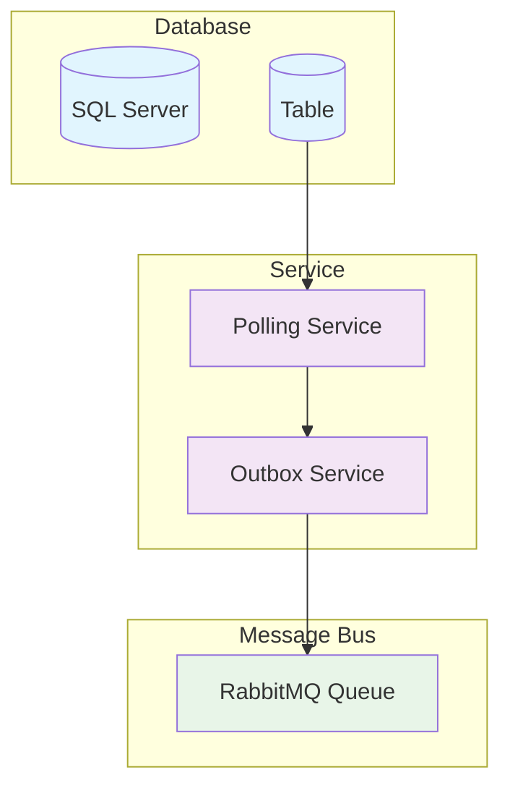
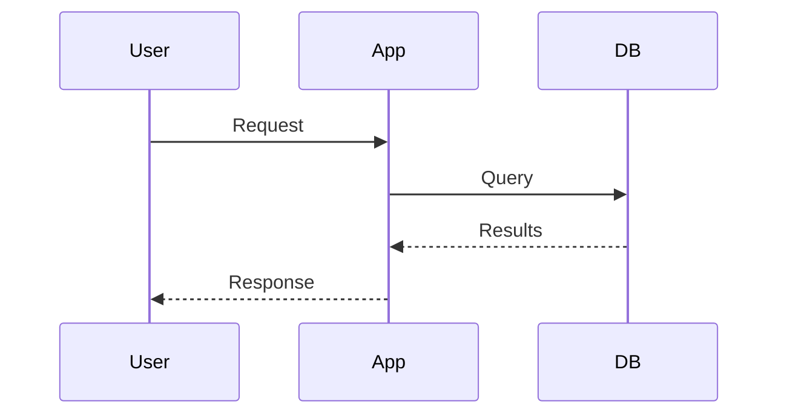

# Mermaid Test File

This is a test file to verify Mermaid diagram rendering in VS Code.

## Simple Test Diagram

## Architecture Diagram Test

## Sequence Diagram Test

---

## Troubleshooting Steps:

1. **Open this file in VS Code**
2. **Press Ctrl+Shift+V** to open markdown preview
3. **Check if diagrams render properly**
4. **Try right-clicking in the preview pane** - look for Mermaid-related options

If diagrams don't render, the extensions may need VS Code restart or there might be conflicts.