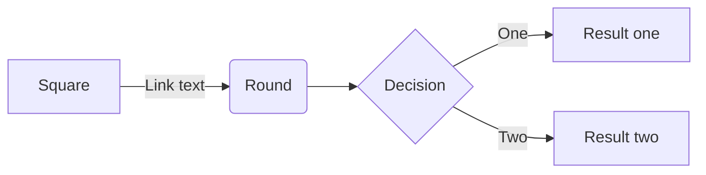
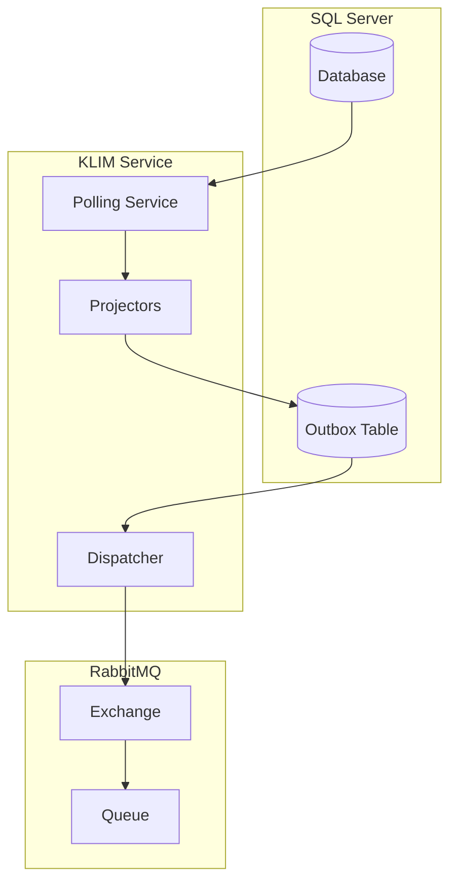

# Mermaid Troubleshooting Guide for VS Code

## ?? **Current Status Check**

You have these Mermaid extensions installed:
- ? `bierner.markdown-mermaid` v1.28.0
- ? `vstirbu.vscode-mermaid-preview` v2.1.2  
- ? `bpruitt-goddard.mermaid-markdown-syntax-highlighting` v1.7.4

## ?? **Step-by-Step Troubleshooting**

### **Step 1: Restart VS Code**
The extensions may need a restart to fully activate:
```bash
# Close VS Code completely and reopen it
# Or use Command Palette: Developer: Reload Window
```

### **Step 2: Test Basic Functionality**
1. Open the `MermaidTest.md` file I just created
2. Press `Ctrl+Shift+V` (Windows/Linux) or `Cmd+Shift+V` (Mac)
3. Check if the simple diagrams render

### **Step 3: Alternative Preview Methods**

#### **Method A: Side-by-Side Preview**
```
1. Open any .md file with Mermaid diagrams
2. Press Ctrl+K V (split view)
3. Edit on left, preview on right
```

#### **Method B: Command Palette**
```
1. Press Ctrl+Shift+P
2. Type "Markdown: Open Preview to the Side"
3. Or "Mermaid: Preview"
```

#### **Method C: Dedicated Mermaid Preview**
```
1. Select a Mermaid code block
2. Press Ctrl+Shift+P  
3. Search for "Mermaid Preview"
4. Or try "Mermaid: Export Diagram"
```

### **Step 4: Check File Associations**
Make sure your `.md` files are associated with markdown:
```
1. Right-click on any .md file
2. "Open With" ? "Configure default editor"
3. Choose "Markdown Preview Enhanced" or "Text Editor"
```

### **Step 5: Enable Extension Features**
Check VS Code settings for Mermaid:
```json
{
  "markdown.mermaid.theme": "default",
  "markdown-preview-enhanced.mermaidTheme": "default",
  "mermaid-markdown-syntax-highlighting.theme": "default"
}
```

---

## ?? **Alternative Solutions**

### **Option 1: Try Different Extension**
```bash
# Uninstall current extensions and try this one
code --uninstall-extension bierner.markdown-mermaid
code --install-extension shd101wyy.markdown-preview-enhanced
```

### **Option 2: Use Online Mermaid Editor**
1. Copy your Mermaid code
2. Go to [mermaid.live](https://mermaid.live)
3. Paste and view/export diagrams

### **Option 3: VS Code Settings Fix**
Add to your VS Code `settings.json`:
```json
{
  "markdown.preview.breaks": true,
  "markdown.preview.linkify": true,
  "markdown.math.enabled": true,
  "markdown.mermaid.theme": "dark"
}
```

### **Option 4: Browser-based Preview**
```bash
# Install a markdown server globally
npm install -g @mermaid-js/mermaid-cli
npm install -g live-server

# Then serve your markdown files
live-server --port=3000
```

---

## ?? **Testing Commands**

Try these in VS Code Command Palette (`Ctrl+Shift+P`):

### **For bierner.markdown-mermaid:**
- `Markdown: Open Preview to the Side`
- `Markdown: Toggle Preview`
- `Markdown: Open Locked Preview to the Side`

### **For vstirbu.vscode-mermaid-preview:**
- `Mermaid Preview: Open Preview to the Side`
- `Mermaid Preview: Generate Image`
- `Mermaid Preview: Export`

### **General Commands:**
- `Developer: Reload Window`
- `Extensions: Reload`
- `Preferences: Open Settings (JSON)`

---

## ?? **Diagnostic Steps**

### **Check 1: Extension Status**
```
1. Go to Extensions tab (Ctrl+Shift+X)
2. Search for "mermaid"
3. Verify all extensions show "Enabled"
4. Look for any error messages
```

### **Check 2: File Syntax**
Make sure your Mermaid blocks use proper syntax:
```markdown

```

NOT:
```markdown
```mer
graph TD
    A --> B
```
```

### **Check 3: VS Code Version**
```
1. Help ? About
2. Ensure you're using VS Code 1.60+ 
3. Update if necessary
```

---

## ?? **Working Example**

Create a file called `test-mermaid.md` with this content:

```markdown
# Working Mermaid Test

## Basic Graph


## Your KLIM Events Architecture

```

---

## ?? **If Nothing Works**

### **Nuclear Option 1: Reset Extensions**
```bash
# Remove all Mermaid extensions
code --uninstall-extension bierner.markdown-mermaid
code --uninstall-extension vstirbu.vscode-mermaid-preview  
code --uninstall-extension bpruitt-goddard.mermaid-markdown-syntax-highlighting

# Install only the most popular one
code --install-extension bierner.markdown-mermaid

# Restart VS Code completely
```

### **Nuclear Option 2: Use External Tools**
```bash
# Install mermaid CLI
npm install -g @mermaid-js/mermaid-cli

# Generate PNG from your markdown
mmdc -i Enhanced_Flow_Architecture.md -o architecture.png
```

### **Nuclear Option 3: Alternative Editors**
- **Typora** - Excellent Mermaid support out of the box
- **Obsidian** - Great for markdown with diagram support
- **Mark Text** - Real-time preview with Mermaid
- **Notion** - Web-based with Mermaid block support

---

## ?? **Verification Checklist**

After trying the solutions above:

- [ ] Can you see diagrams in `MermaidTest.md`?
- [ ] Does `Ctrl+Shift+V` show rendered diagrams?
- [ ] Are there Mermaid options in Command Palette?
- [ ] Can you right-click in preview for Mermaid options?
- [ ] Do diagrams render in `Enhanced_Flow_Architecture.md`?

## ?? **Quick Fix Commands**

Try running these one by one:

```bash
# Reload VS Code window
# Press Ctrl+Shift+P, type "Developer: Reload Window"

# Check extension logs
# Press Ctrl+Shift+P, type "Developer: Show Logs"

# Reset markdown associations  
# Press Ctrl+Shift+P, type "Configure Display Language"
```

Let me know which step works or where you're still having issues!